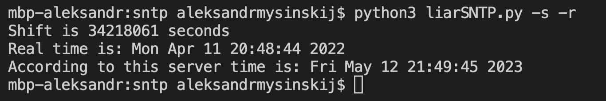

## Liar SNTP
This is __SNTP__ server that "lies" for `${N}` seconds. 
Variable `${N}` ___must___ be the only line in file "config.txt"
********
### How to use
To run the script type at comand prompt 
`cd ${PATH}` 
where `${PATH}` is path to the scipt on your computer 
And then type 
`python3 liarSNTP.py` 
add extra options for launch by using keys if needed. 
List of keys is shown by typing 
`python3 liarSNTP.py -h` 
in comand prompt
*******
### Examples of use
#### Raw usage without keys

#### Cases with keys
 
 

### Main modules
* `main` - cerates socket with imported library `socket`, binds it to port 123
* after receiving an SNTP packet it calls `unpack`
* `unpack` - unpacks SNTP packet
* then `main` calls `make_packet`
* pretty obvious what does `make_packet` method ;) (it makes SNTP packet and changes _only_ one field "Reference")
* and last but not least, `get_shift` - reads "config.txt" and returns current time with shift from config divided into two numbers - integer and fractional part
* the freshly made packet is sent to port 123